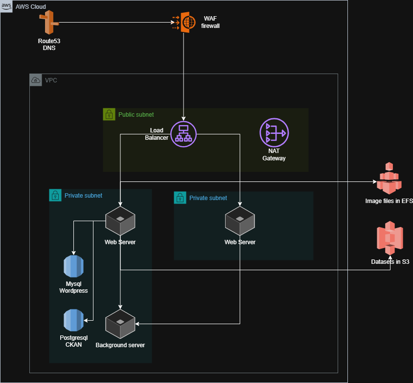

# AWS

The environments are hosted on AWS where they are built using [Cloudformation templates](https://aws.amazon.com/cloudformation/) and CDK code. Each environment consists multiple stack, templates for these are available in [https://github.com/6aika/sixodp-infra](https://github.com/6aika/sixodp-infra) and [https://github.com/6aika/sixodp/tree/master/cdk](https://github.com/6aika/sixodp/tree/master/cdk).

### Database stack

The database stack contains components with irreplaceable data. If the stack is destroyed, the data is lost. The stack contains the following resources:

* Dataset bucket (S3)
* Policies of dataset bucket

The stack takes the following parameters:

* Environment name (pre-defined list)

The stack outputs following parameters:

* Dataset bucket

### CDK based stacks

Rest of the stacks are built using cdk and contains following components:

* Route53 zone for DNS
* WAF firefall for managing access to VPC network
* Load balancer to manage access to multiple web server
* Nat gateway for access to the internet
* 1-2 web servers depending on configuration, these host wordpress and ckan
* Background server for backgound processes like crontab, solr and redis
* 2 databases: Mysql for wordpress and postgresql for ckan
* Image files are hosted in EFS and dataset files in S3

The stacks are also depicted on the following figure:


Additionally to the stacks, each application stack requires access to secrets S3 bucket which is configured within the stack template.

