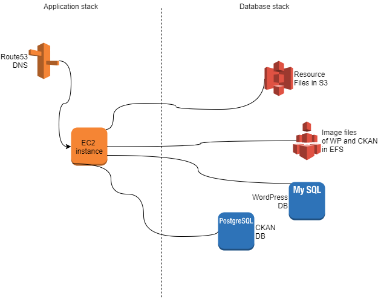

# AWS

The environments are hosted on AWS where they are built using [Cloudformation templates](https://aws.amazon.com/cloudformation/). Each environment consists of two Cloudformation stacks, templates for these are available in [https://github.com/6aika/sixodp-infra](https://github.com/6aika/sixodp-infra). 

### Database stack

The database stack contains components with irreplaceable data. If the stack is destroyed, the data is lost. The stack contains the following resources:

* MySQL database \(RDS instance\)
* PostgreSQL database \(RDS instance\)
* Security group for databases
* Subnet for databases
* Dataset bucket \(S3\)
* Policies of dataset bucket
* NFS network drive for images and its mount targets \(EFS\)
* Security group for EFS

The stack takes the following parameters:

* Environment name \(pre-defined list\)
* Database subnets \(pre-defined list\)
* User name and password for superuser in CKAN \(postgreSQL\) database
* User name and password for superuser in WordPress \(MySQL\) database

The stack outputs following parameters:

* Database security group
* Dataset bucket

### Application stack

The application stack contains the components which can be replaced without data loss. The stack contains following resources:

* Ubuntu 20.04 Virtual machine \(EC2\)
* Security group for EC2
* Ingress rules for database and EFS security groups in database stack.
* Domain name for the portal and pgadmin if the environment manages its own domain.
* Policies for EC2 instance to access S3 buckets
* Elastic IP address if the environment does not manage its own domain, the IP address changes if the stack is destroyed.

 The stack takes the following parameters:

* Environment name \(pre-defined list, should match database stack environment name\)
* Instance type \(pre-defined list\)
* Database security group \(select correct one from the list\)
* EFS security group \(select correct one from the list\)
* Name of the EFS file system \(copy from database stack. At the time of implementation AWS did not have api for this.\)
* Hosted zone id \(select from route53 domains if the environment manages its own domain\)
* White listed ip address in cidr form for allowed ssh access \(default value is Gofore office address\)
* 2 client ip addresses for pgadmin access \(pgadmin UI is available only to these addresses\)
* Git branch \(which branch is used to install application stack\)

The stacks are also depicted on the following figure:


Additionally to the stacks, each application stack requires access to secrets S3 bucket which is configured within the stack template.


