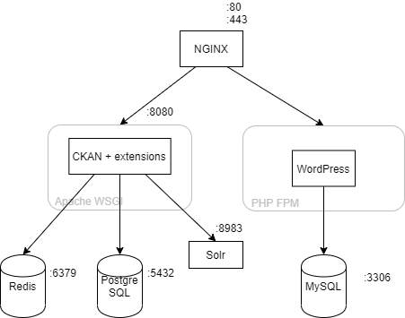

# Yleistä

Portaali koostuu kahdesta palvelusta: WordPressistä sekä CKAN:sta, jotka on asennettu rinnakkain Nginx palvelimen taakse. Yleisarkkitehtuuri on kuvattu seuraavassa kuvassa.

WordPressiä ajetaan [PHP FPM](https://www.php.net/manual/en/install.fpm.php):llä ja CKAN:ia Apachen [WSGI moduulilla](https://modwsgi.readthedocs.io/en/master/). Tulevaisuudessa Apache korvautunee [uWSGI:llä](https://uwsgi-docs.readthedocs.io/en/latest/). Näiden lisäksi palvelussa on useita tietokantoja: WordPress vaatii MySQL:n ja CKAN vaatii PostgreSQL:n lisäksi Redis-tietokannan ja Solr hakukannan.

